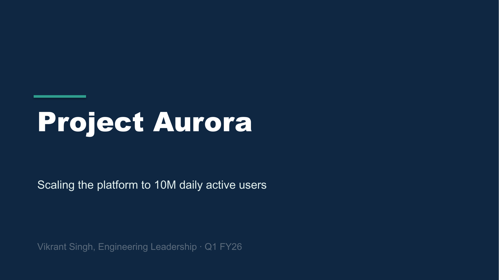
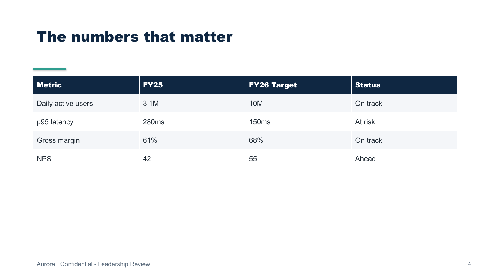
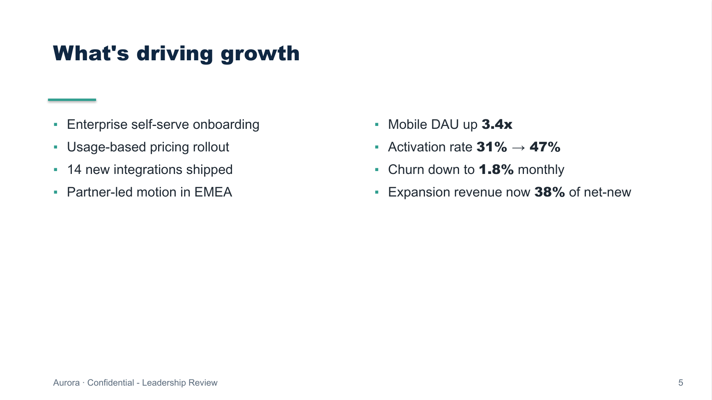
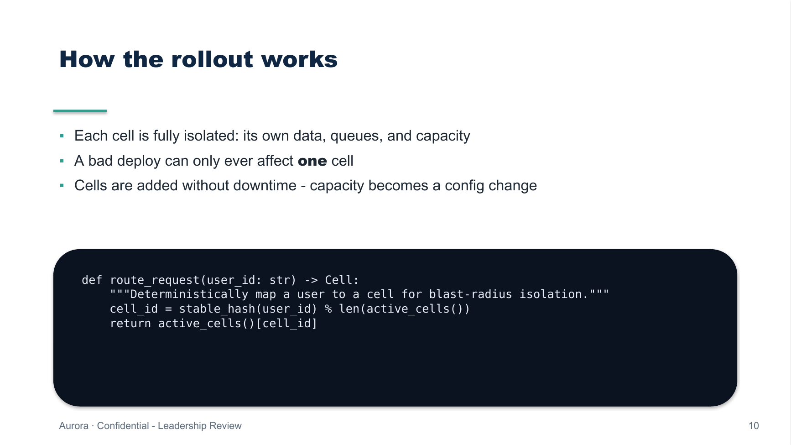

# md2pptx - Markdown → leadership-grade PowerPoint

[](https://github.com/VikrantSingh01/md2pptx/actions/workflows/ci.yml)
[](https://www.python.org/downloads/)
[](LICENSE)
[](https://python-pptx.readthedocs.io/)

Write your deck in **Markdown**. Get a polished, executive-ready **`.pptx`** -
real PowerPoint shapes, real themes, real speaker notes. No templates to wrestle,
no copy-paste, fully scriptable and diff-friendly.

```bash
md2pptx examples/leadership-demo.md -o quarterly-review.pptx
```

<p align="center">
  
  
</p>
<p align="center">
  
  
</p>

---

## Why

Most "markdown to slides" tools render to HTML. Leadership reviews still run on
PowerPoint. `md2pptx` produces a **native `.pptx`** you can open, tweak, and
present in PowerPoint or Keynote - while keeping the *source of truth* in plain
text you can version-control and review in a PR.

- **Leadership-grade by default** - opinionated typography, spacing, and accent
  rules tuned for executive decks, not developer slideware.
- **One source, many decks** - concatenate multiple `.md` files into one deck.
- **Themeable** - three built-in professional themes; add your own in ~20 lines.
- **Speaker notes, tables, code, images, quotes, two-column layouts** - all from
  ordinary Markdown.
- **Tested & dependency-light** - one runtime dependency (`python-pptx`).

## Install

```bash
pip install -e .            # from a clone
# or, once published:
# pip install md2pptx-leadership
```

Requires Python 3.9+.

## Usage

```bash
# Single file (output defaults to <input>.pptx)
md2pptx deck.md

# Explicit output + theme override
md2pptx deck.md -o board-review.pptx --theme midnight

# Combine multiple files into one deck (slides are concatenated in order)
md2pptx intro.md body.md closing.md -o quarterly.pptx

# List themes
md2pptx --themes
```

Or from Python:

```python
from md2pptx import build

build(["intro.md", "body.md"], "out.pptx", theme="executive")
```

## Markdown authoring guide

### Front matter

```markdown
---
title: Project Aurora - FY26 Strategy Review
subtitle: Scaling the platform to 10M daily active users
author: Vikrant Singh
date: Q1 FY26
footer: Confidential - Leadership Review
theme: executive        # executive | midnight | slate
---
```

### Slides & headings

- `---` on its own line starts a new slide.
- The first slide with only a heading becomes the **title slide**.
- `#` is the slide title; a following `##` becomes the subtitle.

### Section dividers & closing

```markdown
<!-- class: section -->

Where we are
```

`<!-- class: section -->` and `<!-- class: closing -->` switch a slide to the
full-bleed brand layouts. The plain line of text becomes the heading.

### Bullets, tables, code, quotes, images

```markdown
## Executive summary

- Revenue up **42% YoY**
  - Driven by *enterprise* adoption
- Reliability at `99.95%`

| Metric | FY25 | FY26 |
| --- | --- | --- |
| DAU | 3.1M | 10M |

> The best architecture lets a small team move fast for years.
> - Engineering Tenets


```

### Two-column layouts

```markdown
## What's driving growth

:::columns
- Enterprise onboarding
- Usage-based pricing
+++
- Mobile DAU up **3.4x**
- Churn down to **1.8%**
:::
```

### Speaker notes

```markdown
## Executive summary

- The headline numbers

Notes:
Open with the ask. Pause for reactions. Keep this under 90 seconds.
```

(or inline: `<!-- notes: keep it short -->`)

## Themes

| Theme | Vibe | Background |
| --- | --- | --- |
| `executive` *(default)* | Deep navy + teal, crisp and corporate | Light |
| `midnight` | Dark, modern, high-contrast | Dark |
| `slate` | Warm editorial, serif headings | Light |

Add your own by registering a `Theme` in
[`src/md2pptx/themes.py`](src/md2pptx/themes.py).

## How it works

```
Markdown ──▶ parser ──▶ Deck (IR) ──▶ renderer ──▶ .pptx
            (model.py)               (python-pptx)
```

The parser is dependency-free and produces a plain-dataclass intermediate
representation; the renderer turns that IR into hand-placed PowerPoint shapes.
The clean split keeps the parser trivially unit-testable and the visual layer
easy to restyle. See [`docs/architecture.md`](docs/architecture.md).

## Develop

```bash
python -m venv .venv && source .venv/bin/activate
pip install -e ".[dev]"
pytest          # run the suite
ruff check .    # lint
```

Regenerate the demo and its screenshots:

```bash
python examples/assets/make_diagram.py
md2pptx examples/leadership-demo.md -o out/leadership-demo.pptx
```

## License

MIT © Vikrant Singh - see [LICENSE](LICENSE).
