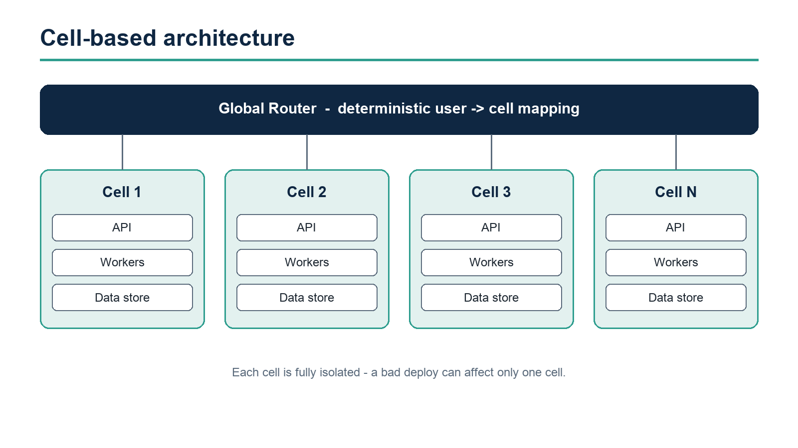

# Project Aurora
## Scaling the platform to 10M daily active users

---

<!-- class: section -->

Where we are

---

## Executive summary

- Revenue run-rate up **42% YoY**, driven by enterprise adoption
- Platform reliability reached **99.95%** availability this quarter
- Two strategic risks need a decision today: *capacity* and *talent*
- Ask: approve **$4.2M** investment to unblock the FY26 roadmap

Notes:
Open with the headline numbers. Pause after the ask so leadership can react.
Keep this slide under 90 seconds.

---

## The numbers that matter

| Metric | FY25 | FY26 Target | Status |
| --- | --- | --- | --- |
| Daily active users | 3.1M | 10M | On track |
| p95 latency | 280ms | 150ms | At risk |
| Gross margin | 61% | 68% | On track |
| NPS | 42 | 55 | Ahead |

---

## What's driving growth

:::columns
- Enterprise self-serve onboarding
- Usage-based pricing rollout
- 14 new integrations shipped
- Partner-led motion in EMEA
+++
- Mobile DAU up **3.4x**
- Activation rate **31% → 47%**
- Churn down to **1.8%** monthly
- Expansion revenue now **38%** of net-new
:::

---

<!-- class: section -->

What we need to decide

---

## Strategic bet: invest in capacity now

The current architecture will hit a hard ceiling at roughly **6M DAU**.
Re-platforming the data tier removes that ceiling and unlocks the latency target.

- **Option A** - Incremental sharding. Lower risk, caps out at ~7M DAU.
- **Option B** - Re-platform to a cell-based architecture. Higher upfront cost, scales past 25M DAU.
- Recommendation: **Option B**, phased over three quarters.

---

## A principle we keep coming back to

> The best architecture is the one that lets a small team move fast for years without rewrites.
> - Aurora Engineering Tenets

---

## Architecture at a glance



---

## How the rollout works

```python
def route_request(user_id: str) -> Cell:
    """Deterministically map a user to a cell for blast-radius isolation."""
    cell_id = stable_hash(user_id) % len(active_cells())
    return active_cells()[cell_id]
```

- Each cell is fully isolated: its own data, queues, and capacity
- A bad deploy can only ever affect **one** cell
- Cells are added without downtime - capacity becomes a config change

---

## The ask

- Approve **$4.2M** for the FY26 platform investment
- Backfill **6 senior engineers** across two squads
- Green-light **Option B** with a phased, quarter-by-quarter rollout
- Decision needed by **end of week** to hold the timeline

---

<!-- class: closing -->

# Thank you
## Questions, challenges, and decisions - let's discuss
